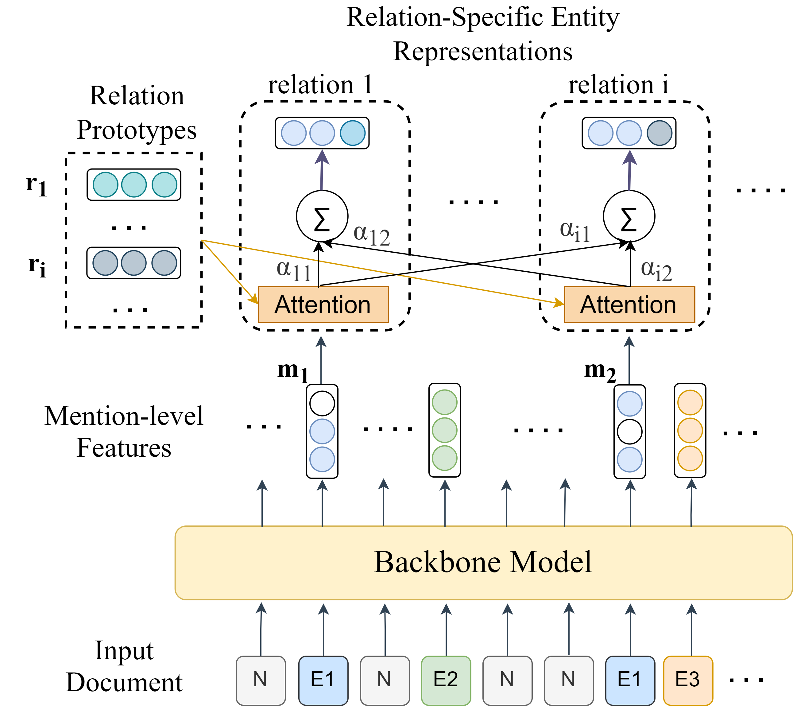

# RSMAN
Source code for NAACL 2022 paper: Relation-Specific Attentions over Entity Mentions for Enhanced Document-Level Relation Extraction
## Introduction
This is the implementation of the **RSMAN** (**R**elation-**S**pecific **M**ention **A**ttention **N**etwork) with [**SSAN**](https://arxiv.org/abs/2102.10249) as the backbone model. **RSMAN** is easy to be plugged into other different backbone models to enhance them and here we take **SSAN** for example. Part of the code is borrowed from https://github.com/BenfengXu/SSAN, and we really appreciate it.
<div  align="center">  

</div>  

## Requirements
* python==3.6
* pytorch==1.4.0
* transformers==2.7.0

## Dataset
* [DocRED](https://github.com/thunlp/DocRED)
* [DWIE](https://github.com/klimzaporojets/DWIE)
* Note that you should process DWIE to fit the same format as DocRED. Put the dataset into the directory `./data`.

## Train
Download pre-trained language models into the directory `./pretrained_lm` and run:
```
python run.py
```
The evaluation on dev set will be run during training at each logging step, and the trained model corresponding to the best dev result will be saved into the directory `./checkpoints`.

## Test
To get the result on test set, run:
```
python run.py --do_train False --do_predict
```
Then a test result file in the official evaluation format will be saved as `./checkpoints/result.json`.
Compress and submit it to [CodaLab](https://competitions.codalab.org/competitions/20717) to get the final test score.

We also provide our trained model and test result file, you can download them from [here](https://drive.google.com/file/d/1deat9OO4F4tZh4KxhcZGK2Wme1Z8dCsC/view?usp=sharing).
